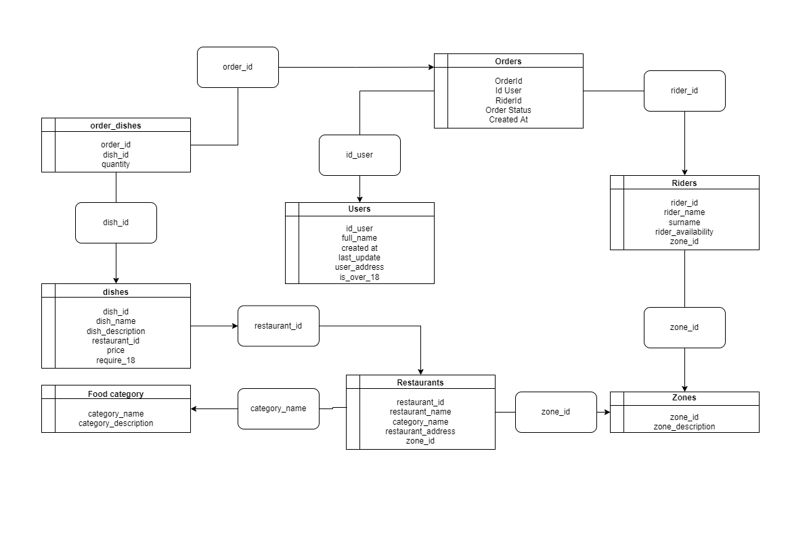
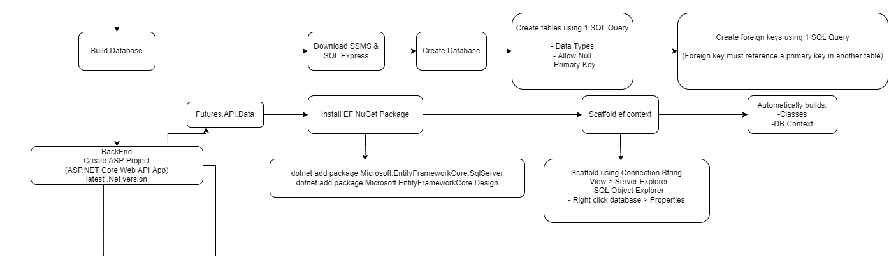
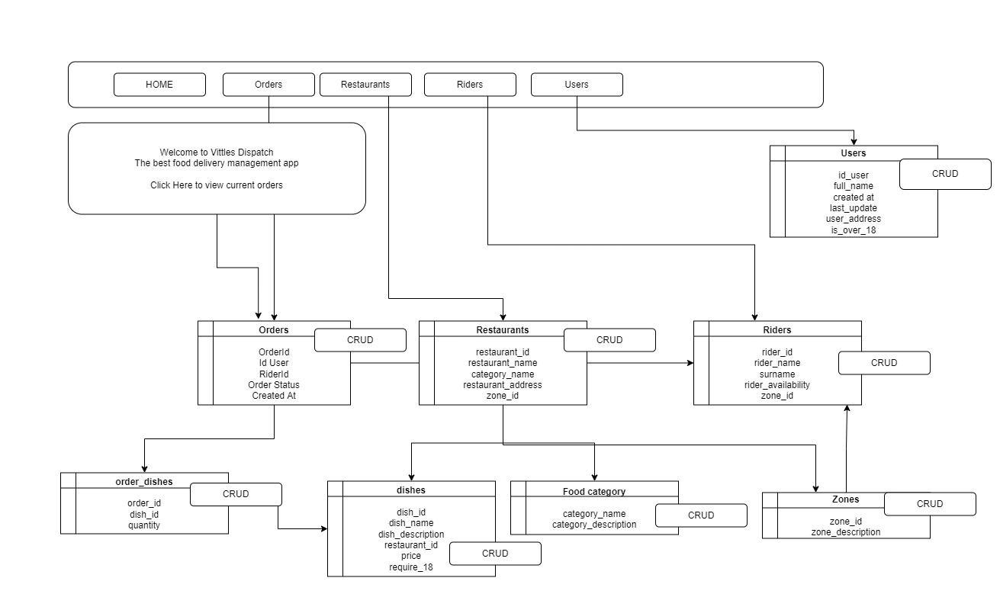
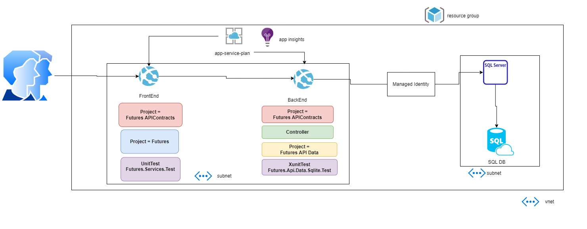

# Introduction

This repo contains the code and story for the Futures track
 
Candidates get access to another project called Futures candidates with the story and tasks
 
Feel free to check the project for candidates to get all the background info and to make sure you have the latest
 

# The Challenge

## Details for the candidates

**Information over the challenge**
- Duration: you have 8 weeks to complete everything
- Timeline: we have split the challenge into several parts, and so we expect a certain amount of time spent on each
- At the end of each part you have to do a 10-15min demo showing your solution, explaining it and answer a few questions
- What if you finish too early? Well, we have plenty of ideas for you to improve the app, so no worries
- What if you finish too late? Each part of the challenge has its allocated time, so we will check on you at regular intervals to make sure you pull it out
- What if I get stuck, like a lot? Getting stuck is unfortunately the best way to learn a programming language, so take a deep breath, make sure you understand the bug/ assignment, and if not do more reading. If even after trying everything you thought possible of, reach out to your tutor only!
- Can we help each other out? We would like you to not share other info with other candidates, why? We just want to make sure that you go through the whole learning process, without going through it, you wouldn't be learning as much, so please do yourself a favour and struggle a bit ;)
- As a hint, please remember that we expect you to do a lot of self-learning for every concept in each part. So understand them, be able to explain them and tell us why you made each choice, be prepared!
- Again, you will be judged not only on the delivered materials, but also on your thinking process.
- There are a lot of resources out there, we recommend looking at the Microsoft/ Azure Doc, C# Corner, Code Maze and the one and only Stack Overflow
- If you reach out to your tutor, we expect you to explain us what you tried, what's not working, why you think it's not working and we will help
- Don't forget to have fun! You're on the right track to create amazing apps :) 

## Story for the candidate

Hello, you just started as .Net Azure Developer in a young start-up
 
The company is new and wants to take over the food delivery market
 
To do so, it needs to create a management app
 
The app will enable the company to see orders, manage restaurants, riders, users... 
 
They expect you to build the entire app from scratch
 
That's right, they've seen what you have learnt over the last months and were quite impressed
 
The app needs to work with a SQL Database
 
Also, you will create a nice GUI to view all orders, manage restaurants, riders, users... but also make CRUD operations directly from a button
 
The frontend consumes API that have been built in the backend which queries the database
 
Every method used must be tested
 
You will use modern techniques such as entity-framework, Unit testing, API calls, Razor Pages...
 
Otherwise you have complete freedom over how you want to go about it, just don't forget to explain why ;)
 
Each part of the challenge will have a small story to give you context, a list of tasks and another for expected deliverables.
 

**Technical details over the challenge**

The app will:
- be created in ASP.Net latest version
- work with a SQL Database that has the following tables: restaurants, users, orders, zones (where restaurants are located), riders, food category, dishes, order_dishes
- have a frontend that displays table information and enable the user to do the following operations, get all, get by id, get by name (where applicable), delete, insert, upsert, add
- have a frontend that uses methods that consume APIs
- use APIs will be in the backend
- use Entity Framework to query the database
- use unit testing 
- have different projects for frontend, backend, testing

## Background information

Approximate Timeline (8 weeks = 40 days):
- Phase 0, preparation and project Set Up => 2 days
- Phase 1, creating a database => 3 days
- Phase 2, creating & testing an API => 10 days
- Phase 3, Testing, Logging and App insights => 5 days
- Phase 4, creating a frontend => 5 days
- Phase 5, create Azure Infrastructure => 5 days
- Phase 6, migrate the app to Azure => 5 days
- Phase 7, Bonus (in case you finish early)

### Phase 0, preparation and project Set Up

**Story for the tutor**
At the start of the challenge, the candidate has to:

- Choose a project management strategy
- Create a project in Azure DevOps, add a ReadMe, select your PM strategy
- Create a Git Repo with a branching strategy
- Create a basic architecture of the app (You can use tools such as DrawIO or app.diagrams), add the picture to the project
- Write a ReadMe to introduce the app
- Create a sprint with work items

Probe the candidate on:

- MVC Concepts 
- Branching strategies
- Create pull requests
- Project management
- Break down work using Azure Boards

Solution:

- The architecture splits the FrontEnd, BackEnd and Db as in separation of concerns
- Each layer is meant to do one thing (View = frontend, controller = receive API calls, Repository = interact with the DB )
- We've made use of interfaces to reuse the methods (interfaces will be introduced later on in the project)
- Goal: make each component flexible, reusable and maintainable ==> this is a key element of OOL (Object Oriented Languages such as C#)
- Please watch the video to have a better understanding of this concept, don't worry if all concepts mentioned in the video are still hard to get

Relevant link: [Object-Oriented Design](https://www.coursera.org/lecture/object-oriented-design/1-3-2-separation-of-concerns-nBqPZ)

### Phase 1, creating a database

**Story for the tutor**

First phase of the project, the candidate has to:

- Make a drawing of the SQL Database with table relationship
- Create the database and table relationships fixing the broken SQL scripts

Probe the candidate on:

- SQL Database concepts and table relationships, foreign/ primary keys, nullable....

Solution:

### Phase 2, creating & testing an API

**Story for the tutor**

Second phase of the project, the candidate has to:
- Create a project in Visual Studio to reflect SQL tables into classes using Entity Framework
- Create CRUD operations using interfaces
- Working with Dependency Injection (DI) and Repository Pattern (RP), create an API project (in the same solution) ([Description](https://dotnettutorials.net/lesson/repository-design-pattern-csharp/))
- Create APIs for each class and method 
- Test the API using Swagger or Postman
- Make sure you understand the joke "there is no place like 127.0.0.1"

Probe the candidate on:

- Entity Framework
- API concepts
- Interfaces
- Dependency Injection
- Repository Pattern

Solution:
Relevant link: [Why Entity Framework Core for an existing database?](https://www.linkedin.com/learning/using-entity-framework-core-with-legacy-databases/why-entity-framework-core-for-an-existing-database?autoplay=true&trk=learning-course_tocItem&upsellOrderOrigin=default_guest_learning)

Work with Entity Framework:

- Our controller will respond to different routes such as  [Route("[restaurant]")] or [Route("[zone]")]
- The route will then include methods and potentially also id, as in [HttpGet("{id?}")] which will respond to the API call zone/get/id=1, the ? signs makes id optional
- Read ([Create web APIs with ASP.NET Core](https://docs.microsoft.com/en-us/aspnet/core/web-api/?WT.mc_id=beginwebapis-c9-cephilli&view=aspnetcore-6.0))
- Or watch the series from Microsoft on Web APIs for beginners ([Create web APIs with ASP.NET Core](https://www.youtube.com/watch?v=eiJuT9W8Q9k&list=PLdo4fOcmZ0oVjOKgzsWqdFVvzGL2_d72v&index=4))
- The second project, that makes the actual API calls (also called consume API) uses Flurl, though you can use many other ways of making the API calls, read through the following link: ([A Few Great Ways to Consume RESTful API in C#](https://code-maze.com/different-ways-consume-restful-api-csharp/))
- Going for Flurl offers advantages, such as being easy to set-up, handles exception... , that makes it an interesting option, you can read through this article (especially the paragraph "How to Write Get, Post, Put/Patch, and Delete Requests") for more details ([How to Write Get, Post, Put/Patch, and Delete Requests](https://code-maze.com/consuming-github-api-rest-with-flurl/))

### Phase 3, Testing, Logging and App insights

**Story for the tutor**

Tasks:
- Create Unit test for controller with high code coverage
- Create logs 

Probe the candidate on:
- Testing (XUnit, Nunit)
- Fake/Moq Data
- Repository vs In-memory testing
- Logging types

Solution:
- There are several ways to create a XUnit project, one of which is repo, though with EF we've had some issues, and so we decided to go for in-memory which worked fine for us
- If you were able to make it work either on repo or in-memory it's all fine! :)
- We've logged information to understand where the code is progressing, that's particularly useful when things don't work to quickly identify WHERE and WHY your code is bugging
- For example you want to know if your API has actually reached the controller, and perhaps even the methods that interact with the DB
- Also, it's always good to know that everything works fine but your database is empty, or the id, name doesn't exist in the db
- Finally, try to log as many error information to the user, in the end your app is going to be running in the cloud with little to no ways of knowing what's happening
- App Insights is quite easy to setup and will be your window into what's going with your code, so log as much as possible :)
- If you fancy, you can check this good tutorial on logging ([High-performance logging in .NET, the proper way](https://www.youtube.com/watch?v=a26zu-pyEyg))

### Phase 4, creating a frontend

**Story for the tutor**

Fourth phase of the project, the candidate has to:
- A diagram of what your frontend is set to look like (optional)
- Fully functioning FrontEnd

Probe the candidate on:
- View/ Models
- Layout
- HTML, CSS, Bootstrap

Solution:
- We created our app as if we were Uber i.e. we would manage restaurants but not orders
- Create  (button type="submit" class="btn btn-primary" Search button) for the search
- Create (table class="table table-dark) for displaying the class
- Instantiate a model "@model RestaurantsModel" and route using id (optional) "@page "{restaurant_id?}"
- Loop through Model "@foreach(var restaurant in Model.RestaurantList) " and display each element e.g. (td>@Html.DisplayFor(modelItem => restaurant.RestaurantId) /td)
- Add the edit and delete button for each row (a asp-page="./RestaurantEdit" asp-route-id="@restaurant.RestaurantId">Edit/a)
- asp-page= searches for a page in your folder
- asp-route-id= will add the id to the next page 

### Phase 5, create Azure Infrastructure

**Story for the tutor**
Fith phase of the project, the candidate has to:
- Add App insights to the solution
- Create the necessary Azure Infrastructure for the app, either using the Azure GUI or using IaaS tools such as Terraform (optional)

Probe the candidate on:
- App service plans, app services, Azure SQL Database, Azure Cosmos DB, App Insights

Solution:

### Phase 6, migrate the app to Azure

**Story for the tutor**
Sixth phase of the project, the candidate has to:
- Migrate the app to Azure and demo that it works

Probe the candidate on:
- Database migration
- Deploying specific projects from one solution to different app-services

### Phase 7, extra's (Work in Progress)

**Deliverables for us:**
- SonarQube
- Refactored project using OData
- Use Automapper
- Use logging & authentication
- Move the app to a container in app service using Azure ACR and Azure Pipelines
- Add Serverless Project
- Add Managed Identity 
- Add DNS Zones and Delegations
- Use backend for the state
- Have Dev and Prd env in Azure

**Deliverables for the candidate:**
- HTTP Queries GET ALL enabling filtering using OData (e.g. Get all filtered by alphabetical name)
- Use Docker commands in the pipeline to build and deploy an image to Azure

**Learning objectives:**
- Learn advanced techniques to query databases
- Learn what containers are and know how to use basic Docker commands in a pipeline

**Description:**
=======
**Description:** Here we can put stuff that can be given as extra assignments if the candidate is far ahead of schedule

